# このプロジェクトについて
Unityで簡単な的当てゲームをつくるキットです。 
敵の見た目を変えたり、敵の出る場所や数なども簡単に変更が出来ます。

## ソフトウェアについて
こちらは Unity のバージョン2019.3,2019.4LTSを想定して作成しています。 
Unity2019.3 (もしくは出ているなら2019.4LTS)をインストールしましょう。

## まず初めに
まず初めに 上側のメニューにある「ツール」の「作業用レイアウト」を押しましょう 
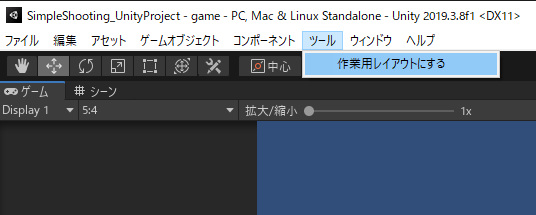

そうすると、ウィンドウのレイアウトが勝手に変更されて、このような感じになります 
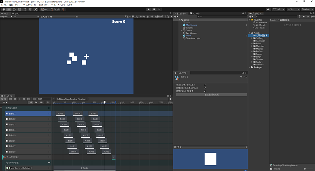

## 早速ゲームで遊んでみる

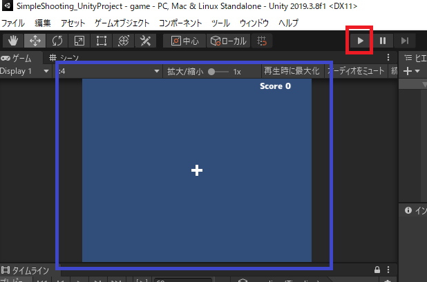
赤い枠の部分を押してゲーム開始です。 
青い枠の所が実際にゲームで遊べる部分です。マウスで狙いを定めて、クリックして球発射です 
時間がたつと勝手にゲームが終了します。 
爆発に巻き込めば得点アップです。時間内にハイスコアを目指しましょう。 

## 敵の見た目を変えてみる
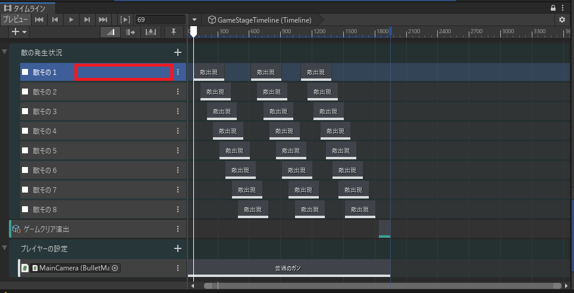 
左下の「タイムライン」ウィンドウで、画面の赤い辺りをクリックしてください。 
 

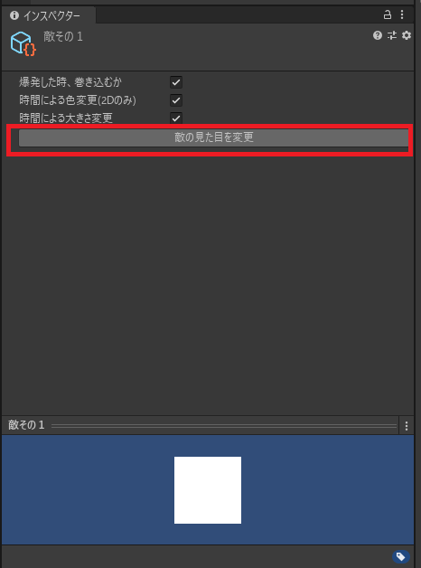 
右側にある「インスペクター」ウィンドウが画面のように変わります。 
変わったら「敵の見た目を変える」ボタンを押してください 

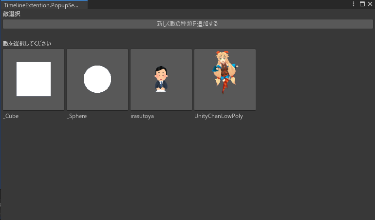 
ボタンを押すと、このような画面が出てきます。好きな絵をクリックすると、敵の見た目が変わります。 
 
敵は8体分あります。他の敵も同じように見た目を変える事が出来ます。

## 敵のタイミングを変えてみる
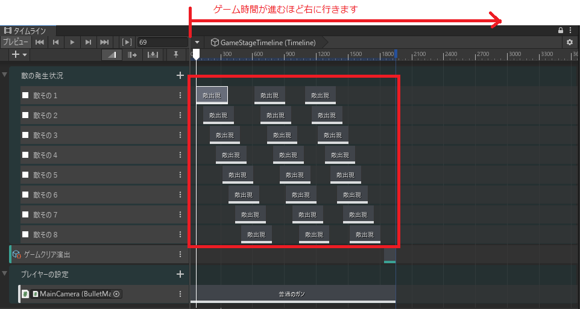 
ここの「タイムライン」ウィンドウの赤枠の所で敵の出すタイミングを制御できます。
一個一個の「敵の出現」の場所をずらしたり、伸ばしたりすることで敵の出るタイミングが変更出来ます。

## 敵の位置を変えてみる
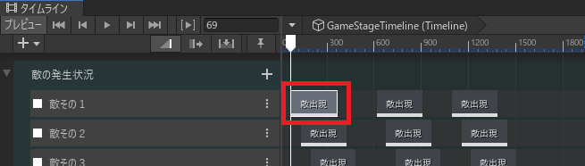 
「タイムライン」ウィンドウで「敵出現」をクリックして選択しましょう。 

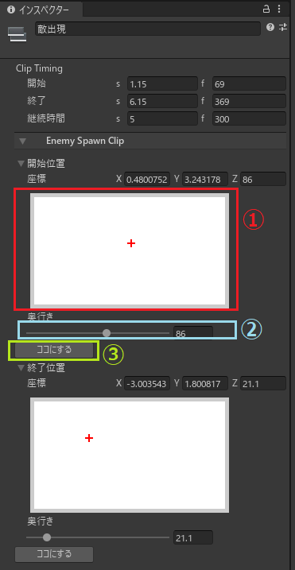 
そうすると「インスペクター」ウィンドウがこのように変わります。 
 
１.ここの好きな場所をクリックしましょう。敵の出てくる場所を設定します。 
　※赤の十字がいまの設定、青が新しく設定したい場所です。 
２.どのくらい奥から敵が出てくるかを設定します。 
３.ここにするボタンを押すと、１・２で設定した場所に敵が出てきます。 
 
下側の終了位置も同じように変更できます。 
敵は開始位置から出て、終了位置を目指して進みます。 

## 好きな絵を敵にしてみる

### 1.絵をプロジェクトに取り込む
好きな絵を出すためには、Unityのプロジェクトに画像ファイルを登録する必要があります。 
「プロジェクト」ウィンドウで「1_画像置き場」を選択して、好きな絵をドラッグ＆ドロップで取り込みましょう 
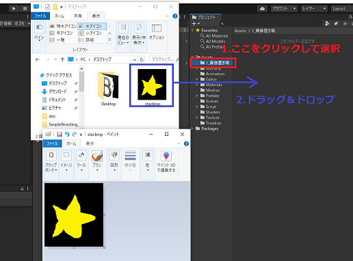 

無事取り込めたら、「プロジェクト」の中に絵が入ります。 
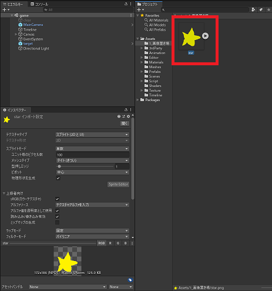 

※透明な画像を用意できなかった方のために……。 
四隅が同じ色だった時に、その色を透明にする機能も付けました。 
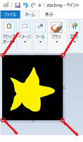 

自動的に検出して、ダイアログが出ます。 
透明にしたい場合は「はい」を押してください。 
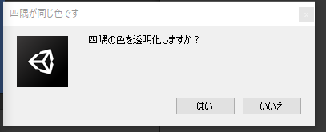 

## 2.取り込んだ絵から「新しく敵の種類を追加する」

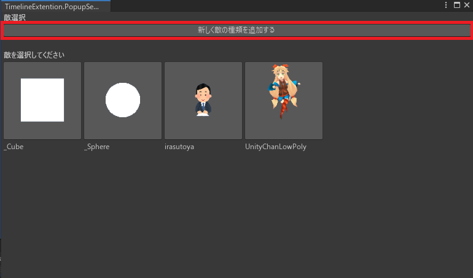 

敵のキャラを変えるときの画面に、「新しく敵の種類を追加する」というボタンがあります。 
ここを押すと、こんな画面が出てきます。 
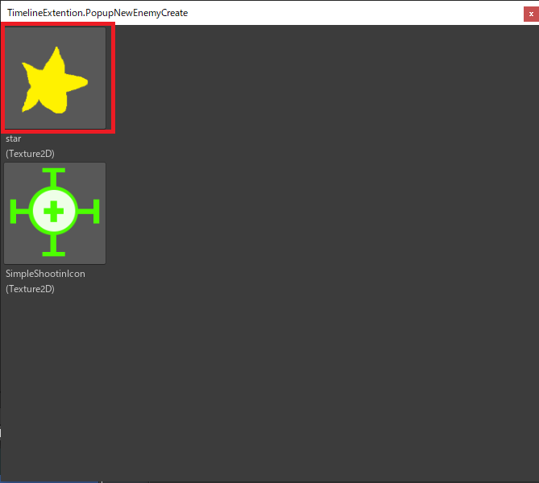 

ここで取り込んだ絵をクリックして… 
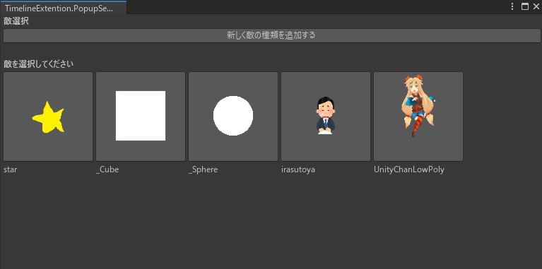 
新しい種類が増えていれば完成です！
